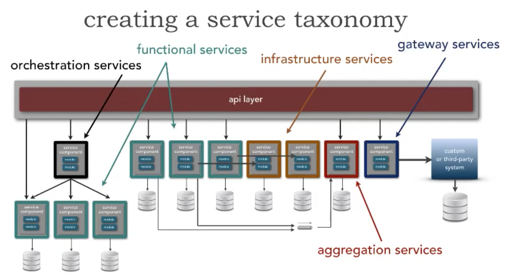

# Taxonomia de Serviços
_Taxonomia de serviços_ é uma forma de apresentar a arquitetura de um ecossistema agrupando e classificando os serviços
pelo seu tipo e propósito, por exemplo serviços _agregadores_, serviços de _orquestração_, etc.

Pelo exemplo da imagem anterior podemos descrever essas classificações como:

* **Orchestration Services**: API pública responsável por orquestrar multiplos requests a diferentes serviços a fim de compor uma informação relevante para um único request de negócio.
* **Functional Services**: API pública responsável por servir funcionalidades de negócio.
* **Infrastructure Services**: API ou serviço privado responsável por prover ferramentas de infraestrutura (por exemplo _logs_).
* **Aggregation Services**: API e/ou serviço público responsável por agregar informações de negócio de diferentes fontes para responder um único request de negócio.
* **Gateway Services**: API pública responsável por ser uma fachada para serviços de terceiros.

## Referências
* [Creating a Service Taxonomy](https://www.developertoarchitect.com/lessons/lesson33.html)
